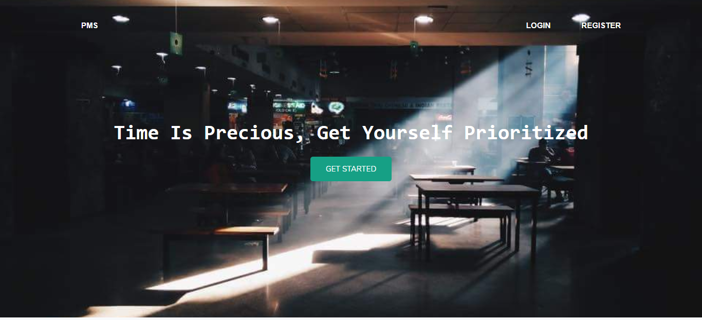

#### (1.0) Project Introduction:
  Priority Management System is integrated and automation software system for NSU canteen.By this system Student will easily get their token for food order. In this PM System student will have to fill a form by their courses, class timing and their academic information with uploading advising slip image. After done with giving information, student will get a interface to place an request for token. The syetem will automaticallly give a random token number for food order. The PM system will provide user dashboard for edit and update their information by semester wise. The most important part of priority management system is priority based Queue. The Queue will automatically prioritize based on class timing. If any student class timing is close to the current timing, the system will give priority first for that student. If multiple students have same class timing, then the system will analysise the next close class timing of those students and then give priority. This is how the PM system will work.

#### (2.1) Browser View:
    

#### (2.2) Use of Technology and Language:

      * MVC framework (Laravel)
      * PHP
      * JavaScript
      * JQuery
      * MySQL Database
      * Xampp Local server
      * Bootstrap 4
      * HTML, CSS

